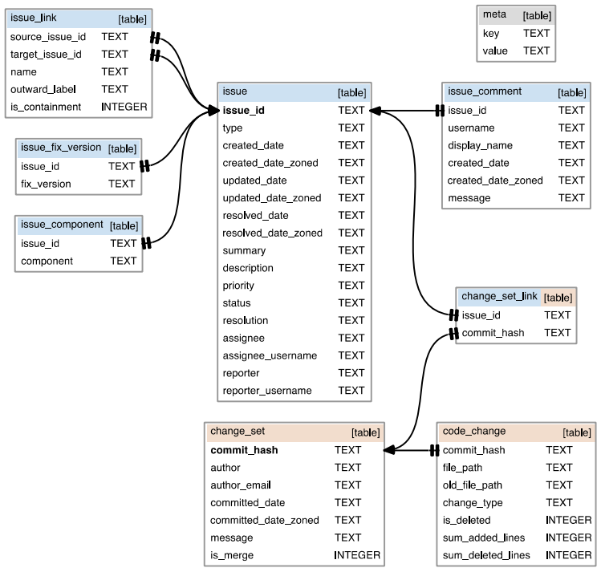

# Table of Contents

* [General info](#1)
* [Data model](#2)
* [Requirements](#3)
* [How to run](#4)

<h2 id="1"> General info </h2>
This is the replication package for ABLoTS approach proposed by Rath et al [1](#ref-1).

- [1] [M. Rath, D. Lo, and P. M ̈ader, “Analyzing requirements and traceability
information to improve bug localization,” in Proceedings of the 15th
International Conference on Mining Software Repositories, 2018, pp.
442–453.]

<h2 id="2"> Data model </h2>
/data/errai.sqlite3 is the information for errai project in the data set. For each project, the data set includes information as follows:

M. Rath and P. M ̈ader, “The seoss 33 dataset—requirements, bug reports,
code history, and trace links for entire projects,” Data in brief, vol. 25,
p. 104005, 2019.

<h2 id="3"> Requirements </h2>

<h2 id="4"> How to run </h2>
